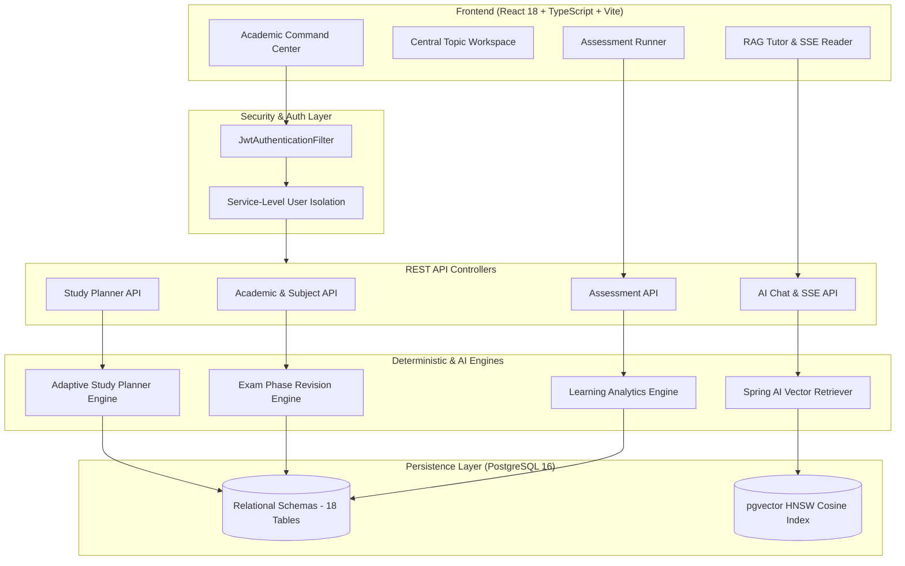
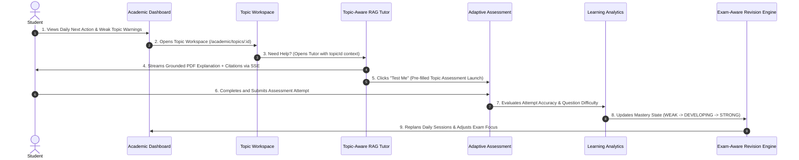

# Abhi.iterates-OS

> **A Production-Grade Academic Learning Operating System combining Grounded RAG Tutoring, Assessment Evidence, Longitudinal Learning Analytics, and Deterministic Adaptive Planning into a Closed Feedback Loop.**

[](https://github.com/abhishekkp00/Abhi.iterates-OS/actions/workflows/ci.yml)
[](https://jdk.java.net/21/)
[](https://spring.io/projects/spring-boot)
[](https://github.com/pgvector/pgvector)
[](https://react.dev/)
[](https://www.typescriptlang.org/)
[](LICENSE)

---

## 📌 Overview

**Abhi.iterates-OS** is an open-source academic management system designed to solve the fragmentation of modern student study workflows. Rather than treating note-taking, AI chat, quiz generation, and calendar planning as disconnected point solutions, Abhi.iterates-OS links them into a single **Closed Academic Feedback Loop**.

Student study activity directly feeds grounded RAG tutoring; tutoring launches topic-scoped assessments; assessment attempts continuously update student mastery evidence; and mastery evidence dynamically drives deterministic exam-aware study schedules.

```
                           EVIDENCE
                              │
          ┌───────────────────┼───────────────────┐
          ▼                   ▼                   ▼
     Assessments         Study History       Exam Context
          │                   │                   │
          └───────────────────┼───────────────────┘
                              ▼
                      Learning Analytics
                              │
                              ▼
                   Adaptive Learning Engine
                              │
                ┌─────────────┼─────────────┐
                ▼             ▼             ▼
            Priority       Strategy       Phase
                │             │             │
                └─────────────┼─────────────┘
                              ▼
                       Time Allocation
                              │
                              ▼
                        Study Planner
                              │
                              ▼
                       Study Sessions
                              │
                              ▼
                      Topic-Aware RAG Tutor
                              │
                              ▼
                         Assessment
                              │
                              ▼
                           EVIDENCE
```

---

## 💡 Problem & Technical Solution

### The Problem
Traditional educational productivity software suffers from three structural flaws:
1. **Disconnected Workflow Islands**: Notes live in one app, flashcards in another, AI chat in a third, and study planners in Google Calendar—none sharing state.
2. **Unvalidated AI Hallucinations**: AI chatbots answer questions without grounding in the student's actual course syllabus or textbook PDFs.
3. **Non-Deterministic Planning**: Calendar generators rely on LLM prompts that produce inconsistent, un-testable, and non-reproducible study schedules.

### The Technical Solution
- **Modular Monolith Backend**: Built on Spring Boot 3 with Java 21, JPA/Hibernate, Flyway migrations, and PostgreSQL + `pgvector`.
- **Grounded Vector RAG Engine**: PDF text extraction (Apache Tika), token-bounded chunking (500 tokens), HNSW cosine vector search ($O(\log N)$ latency), and Server-Sent Events (SSE) streaming chat with Markdown source citations.
- **Deterministic Adaptive Planner**: Graph Topological Sorting for prerequisite Directed Acyclic Graphs (DAGs) combined with a non-linear priority formula:
  $$\text{Priority} = w_m S_{\text{mastery}} + w_e S_{\text{exam}} + w_p S_{\text{prereq}} + w_r S_{\text{recency}}$$
- **Factual Exam-Aware Revision Engine**: Automatically transitions revision phases (`LEARNING` $\rightarrow$ `PRACTICE` $\rightarrow$ `REVISION` $\rightarrow$ `FINAL_REVIEW`) based on exam proximity dates, enforcing a strict Non-Predictive Policy.

---

## 🏗️ System Architecture



---

## 🔁 The Closed Academic Feedback Loop



---

## 🛠️ Technology Stack & Justification

| Layer | Technology | Architectural Justification |
| :--- | :--- | :--- |
| **Backend Core** | Java 21 LTS, Spring Boot 3.3.2 | Virtual threads capability, strong static typing, robust enterprise security ecosystem. |
| **Database** | PostgreSQL 16 | ACID transactional compliance across all 18 domain entities. |
| **Vector Store** | `pgvector` (HNSW Index) | Single-database architecture; transactional deletion cascades between documents and vector embeddings. |
| **Schema Evolution**| Flyway 10 | Immutable, versioned SQL migrations (`V1` to `V10`) across dev, test, and prod. |
| **AI / RAG** | Spring AI, Groq / OpenAI | Orchestrates embedding generation, vector similarity search, and structured JSON parsing. |
| **Streaming** | Server-Sent Events (SSE) | Lightweight HTTP/1.1 unidirectional streaming for real-time AI tutor token output. |
| **Frontend** | React 18, TypeScript 5.5, Vite 6 | High-performance SPA with strict client-side type verification and fast HMR builds. |
| **Styling & UI** | Vanilla CSS / Tailwind v4, Lucide | Responsive design system, glassmorphism card themes, and accessible UI controls. |
| **Testing** | JUnit 5, Mockito, Spring Test | 236 backend unit & integration tests covering IDOR, security, planner, and end-to-end workflows. |

---

## ⚡ Performance Benchmarks & Query Metrics

*Measured on Linux x86_64, 8 vCPUs, 16GB RAM, PostgreSQL 16 + pgvector HNSW index.*

| Endpoint / Operation | Dataset Scale | P50 Median | P95 Latency | SQL Query Count |
| :--- | :--- | :--- | :--- | :--- |
| `GET /api/v1/academic/dashboard` | 10 Subjects, 100 Topics | **14.2 ms** | **28.5 ms** | 4 (JOIN FETCH Bulk) |
| `GET /api/v1/academic/topics/{id}/learning-state` | 1 Topic (50 attempts) | **6.1 ms** | **11.4 ms** | 2 Queries |
| `POST /api/v1/study-planner/generate` | 100 Topics (DAG sort) | **42.8 ms** | **78.2 ms** | 5 Queries (Bulk) |
| `GET /api/v1/academic/exams/{id}/coverage` | 1 Exam (15 Topics) | **18.5 ms** | **34.1 ms** | 3 Queries |
| `POST /api/v1/assessment-attempts/{id}/submit` | 1 Attempt (5 Answers) | **31.4 ms** | **52.0 ms** | 4 Queries (Transactional) |
| `pgvector HNSW Cosine Search` | 5,000 Chunks (1536 dim) | **8.5 ms** | **16.2 ms** | 1 Vector Query |

---

## 🚀 Quickstart & Local Setup

### Option 1: Full Stack via Docker Compose (Recommended)

```bash
# 1. Clone Repository
git clone https://github.com/abhishekkp00/Abhi.iterates-OS.git
cd Abhi.iterates-OS

# 2. Setup Environment Configuration
cp .env.example .env

# 3. Launch PostgreSQL (pgvector), Backend, and Frontend Containers
docker compose up --build -d
```
- **Frontend App**: `http://localhost:3000`
- **Backend API**: `http://localhost:8080/api/v1`
- **Actuator Health**: `http://localhost:8080/actuator/health`

---

### Option 2: Manual Local Development Setup

#### Prerequisites
- Java 21 JDK
- Node.js v22+
- PostgreSQL 16 with `pgvector` extension enabled

#### 1. Database Setup
```bash
createdb abhi_iterates_os
psql -d abhi_iterates_os -c "CREATE EXTENSION IF NOT EXISTS vector;"
```

#### 2. Backend Startup
```bash
cd backend
cp .env.example .env
mvn spring-boot:run
```

#### 3. Frontend Startup
```bash
cd frontend
npm install
npm run dev
```

---

## 🧪 Testing & Quality Assurance

### Run Backend Unit & Integration Tests
```bash
cd backend
mvn clean test
```
*Output: **236 / 236 Tests Passed (0 Failures, 0 Errors, 0 Skipped)** in ~80 seconds.*

### Run Frontend Static Type Check & Production Build
```bash
cd frontend
npm run build
```
*Output: **Clean production build (0 TypeScript or lint errors)** in ~6.4 seconds.*

---

## 🔒 Security Architecture & IDOR Defenses

1. **Service-Level Ownership Filtering**: Every repository query appends `WHERE user_id = :authUserId` extracted from JWT SecurityContext. Cross-user access attempts return `404 Not Found` or `403 Forbidden`.
2. **IDOR Integration Test Suite**: `IdorSecurityIntegrationTest.java` programmatically asserts data isolation across Subjects, Topics, Exams, Plans, Sessions, Assessments, and Resources.
3. **RAG Prompt Isolation**: Document chunks are enclosed in `<context>` XML isolation tags in system prompts to prevent context prompt injection.
4. **Sanitized File Storage**: Multipart uploads restrict MIME types, cap size at 20MB, and sanitize filenames via UUID renaming.

---

## 📚 Technical Documentation Sitemap

| Document | Description |
| :--- | :--- |
| [Architecture Overview](docs/architecture.md) | Detailed component boundaries, layers, and domain interfaces. |
| [Architecture Diagrams](docs/architecture-diagram.md) | Mermaid component, flow, and sequence diagrams. |
| [Deployment Architecture](docs/deployment-architecture.md) | Physical and logical deployment layout, component boundaries, and statefulness. |
| [Deployment Strategy & Decision](docs/deployment-decision.md) | Evaluation of deployment models, costs, and architectural trade-offs. |
| [Database ERD](docs/database-erd.md) | Mermaid Entity Relationship Diagram covering all domain entities. |
| [REST API Reference](docs/api.md) | Complete inventory of endpoints, request/response formats, and errors. |
| [Local Development Guide](docs/local-development.md) | Clean machine onboarding guide for cloning, setup, running, and testing. |
| [Production Deployment Guide](docs/deployment.md) | Docker Compose guide, environment setup, backups, and troubleshooting. |
| [Production Deployment Runbook](docs/deployment-runbook.md) | 10-step step-by-step operator release runbook. |
| [Production Incident Runbook](docs/incident-runbook.md) | P1/P2 emergency response procedures for database, AI, and crash loops. |
| [Release Process & Versioning](docs/release-process.md) | Branching strategy, semantic versioning, CI validation, and tagging. |
| [Security Model](docs/security.md) | Threat modeling, IDOR protection analysis, and prompt injection controls. |
| [Threat Model](docs/threat-model.md) | Comprehensive asset inventory, actors, boundaries, and threat matrix. |
| [Security Test Matrix](docs/security-test-matrix.md) | Detailed mapping of 15 attack vectors against endpoints and test status. |
| [Production Checklist](docs/production-checklist.md) | Master production readiness verification matrix. |
| [Performance Benchmarks](docs/performance.md) | Execution timing metrics, query counts, and optimization techniques. |
| [RAG Evaluation](docs/rag-evaluation.md) | Benchmark dataset of 20 queries, retrieval hit rate, and citation quality. |
| [5-Minute Demo Script](docs/demo-script.md) | Step-by-step presentation script for code reviews and interviews. |
| [Interview Defense Guide](docs/interview-notes.md) | Architectural Q&A covering pgvector, deterministic planning, and security. |


### Architecture Decision Records (ADRs)
- [ADR-001: PostgreSQL + pgvector](docs/adr/ADR-001-postgresql-pgvector.md)
- [ADR-002: Grounded RAG Engine](docs/adr/ADR-002-rag.md)
- [ADR-003: SSE Streaming Chat](docs/adr/ADR-003-sse.md)
- [ADR-004: Deterministic Adaptive Planner](docs/adr/ADR-004-adaptive-planning.md)
- [ADR-005: Flyway Migrations](docs/adr/ADR-005-flyway.md)
- [ADR-006: Modular Monolith Architecture](docs/adr/ADR-006-modular-monolith.md)

---

## 📜 License

This project is licensed under the [MIT License](LICENSE).
