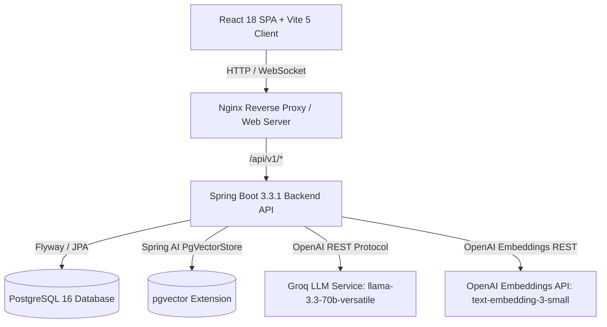

# AbhiIterates.OS — Student Academic Productivity Operating System

AbhiIterates.OS is a full-stack academic productivity operating system designed for university students. It integrates study resource management, adaptive study planning, AI-powered tutoring, Retrieval-Augmented Generation (RAG) over course documents, campus marketplace listings, notifications, analytics, and administrative moderation into a single platform.

---

## Architecture Overview


```mermaid
graph TD
    Client[React 18 SPA + Vite 5 Client] -->|HTTP / WebSocket| Nginx[Nginx Reverse Proxy / Web Server]
    Nginx -->|/api/v1/*| SpringBoot[Spring Boot 3.3.1 Backend API]
    SpringBoot -->|Flyway / JPA| Postgres[(PostgreSQL 16 Database)]
    SpringBoot -->|Spring AI PgVectorStore| PgVector[(pgvector Extension)]
    SpringBoot -->|OpenAI REST Protocol| Groq[Groq LLM Service: llama-3.3-70b-versatile]
    SpringBoot -->|OpenAI Embeddings REST| OpenAI[OpenAI Embeddings API: text-embedding-3-small]
```

### Request Lifecycle Flow
1. **Client Layer**: React 18 single-page application built with TypeScript 5.5, TanStack Query v5 for caching and optimistic updates, Zustand for local client state, and TailwindCSS for styling.
2. **Reverse Proxy Layer**: Nginx proxies incoming REST API requests (`/api/v1/*`) and SSE streaming calls (`/api/v1/ai/chat/stream`) to the Spring Boot application container.
3. **Backend Core Layer**: Spring Boot 3.3.1 application executing on Java 21, enforcing JWT security filters, role-based authorization (`ROLE_USER`, `ROLE_CREATOR`, `ROLE_ADMIN`, `ROLE_SUPER_ADMIN`), transaction boundaries, and DTO validation.
4. **Data & Vector Layer**: PostgreSQL 16 relational database running the `pgvector` extension. Schema migrations are managed by Flyway (V1 through V12).
5. **AI & RAG Services**: Spring AI 1.0.0 abstraction layer connecting to Groq LLM API (`llama-3.3-70b-versatile`) for chat responses and OpenAI Embeddings API (`text-embedding-3-small`) for 1536-dimensional vector embeddings.

---

## Technology Stack & Provider Versions

| Component | Framework / Technology | Version | Purpose |
|---|---|---|---|
| **Language Runtime** | OpenJDK / Eclipse Temurin | `21` | LTS Java execution environment |
| **Backend Framework** | Spring Boot | `3.3.1` | REST API, Security, Transactions |
| **AI Framework** | Spring AI | `1.0.0` | Provider abstraction for ChatClient & VectorStore |
| **Relational Database** | PostgreSQL | `16` | Persistent relational storage |
| **Vector Database** | pgvector | `pg16` | In-database HNSW vector indexing |
| **Database Migrations**| Flyway | `10.x` | Version-controlled DDL migrations (V1-V12) |
| **LLM Provider** | Groq API | `llama-3.3-70b-versatile` | High-performance inference via OpenAI-compatible endpoint |
| **Embedding Provider** | OpenAI API | `text-embedding-3-small` | 1536-dimensional vector embedding model |
| **Frontend UI** | React | `18.3.1` | Client view layer |
| **Build System** | Vite | `5.4.8` | Client bundler & dev server |
| **Language** | TypeScript | `5.5.3` | Type safety across frontend models and hooks |
| **Server State** | TanStack React Query | `5.101.2` | Data fetching, caching, and optimistic updates |
| **Client State** | Zustand | `5.0.14` | Modular client-side state stores |
| **Styling** | TailwindCSS | `3.4.19` | Custom UI styling system |
| **Web Server / Proxy** | Nginx | `alpine` | SPA routing fallback & backend API reverse proxy |
| **Containerization** | Docker & Docker Compose | `3.8+` | Isolated containerized deployment |
| **CI/CD** | GitHub Actions | `v4` | Automated build, test, and container packaging |

---

## Features Actually Implemented

### 1. Library & Resource Management
- **CRUD Operations**: File upload, metadata validation, category/subject tagging, full-text search, filtering, and soft-delete (`ResourceStatus.ARCHIVED`).
- **User Actions**: Star/favorite resources, pin resources, increment view/download counts, and access secure attachment previews.
- **Access Control**: Owner-only mutation authorization and multi-tenant resource privacy.

### 2. AI Tutor & Streaming Chat
- **Provider Abstraction**: Groq API integration using OpenAI-compatible endpoint (`https://api.groq.com/openai`). API keys exist exclusively on the backend.
- **Streaming Responses**: Server-Sent Events (SSE) streaming (`GET /api/v1/ai/chat/stream`) with real-time token tracking.
- **Conversation Persistence**: Per-user conversation ownership, history tracking, title updates, and deletion.
- **Rate Limiting & Safety**: Token bucket rate limiter (10 streams/min, 20 chats/min) and prompt system safety rules.

### 3. RAG Document Ingestion & Retrieval
- **Ingestion Pipeline**: Document text extraction (PDF & plaintext), chunking (`DocumentChunker`), and metadata enrichment (`userId`, `resourceId`, `filename`).
- **Vector Storage**: 1536-dimensional embeddings stored in the `ai_vector_store` table with PostgreSQL HNSW cosine distance index.
- **Multi-Tenant Isolation**: Similarity search queries enforce strict metadata filters (`user_id = :userId`), preventing cross-user document retrieval.
- **Lifecycle Cleanup**: Cascade deletion of vector embeddings when parent resources are deleted.

### 4. Planner & Productivity System
- **Task CRUD**: Priority levels (`LOW`, `MEDIUM`, `HIGH`, `URGENT`), status transitions (`PENDING`, `IN_PROGRESS`, `COMPLETED`, `CANCELLED`), and due dates.
- **Academic Integration**: Exam-aware revision planning, study session logging, and progress tracking against course topics.
- **Client Synchronization**: TanStack Query cache management and safe optimistic UI updates.

### 5. Campus Marketplace
- **Listing Lifecycle**: Create, edit, search, filter by category/price, and transition listing status (`AVAILABLE` -> `SOLD`).
- **Seller Security**: Server-side price validation and owner-only listing modification guards.
- **Checkout Display**: Static UPI ID display for direct campus buyer-seller transactions.

### 6. Realtime Notification System
- **Notification Events**: System events for task deadlines, resource sharing, and marketplace activity.
- **Status Tracking**: Unread count tracking, individual mark-read (`PUT /api/v1/notifications/{id}/read`), and mark-all-read.
- **Delivery Channels**: Persistent DB notifications supplemented by WebSocket/STOMP push (`WsNotificationPublisher`).

### 7. Canonical Analytics Engine
- **Database Aggregations**: Real user-scoped queries calculating study time, completed tasks, resource interactions, AI token usage, and marketplace activity.
- **Dashboard Synchronization**: Unified canonical metric definitions across dashboard summary and deep-dive analytics pages.

### 8. Admin Security & Hardening
- **Server-Side RBAC**: Strict role enforcement (`ROLE_ADMIN` and `ROLE_SUPER_ADMIN`) across all administrative controllers (`/api/v1/admin/**`).
- **Privilege Escalation Protection**: Non-`SUPER_ADMIN` users are blocked from granting `ROLE_SUPER_ADMIN` or modifying system admin accounts.
- **Audit Logging**: Structured audit log persistence (`AuditLogRepository`) recording administrative mutations, target user IDs, IP addresses, and timestamps.

---

## Local Setup & Prerequisites

### Required Tools
- **Java**: OpenJDK 21 or Eclipse Temurin 21+
- **Build Tool**: Apache Maven 3.9+ (or included `./mvnw`)
- **Node.js**: Node.js 22+ and npm 10+
- **Database**: PostgreSQL 16 with `pgvector` extension (or Docker)

### Quick Start (Local Development)

1. **Clone the repository**:
   ```bash
   git clone https://github.com/abhishekkp00/Abhi.iterates-OS.git
   cd Abhi.iterates-OS
   ```

2. **Configure Environment Variables**:
   ```bash
   cp .env.example .env
   ```
   Edit `.env` to set your required secrets (`JWT_SECRET`, `ADMIN_PASSWORD`, `GROQ_API_KEY`, `OPENAI_API_KEY`).

3. **Start PostgreSQL + pgvector via Docker**:
   ```bash
   docker compose up postgres -d
   ```

4. **Run Backend Application**:
   ```bash
   cd backend
   mvn spring-boot:run
   ```
   The backend API will be available at `http://localhost:8080`.

5. **Run Frontend Application**:
   ```bash
   cd frontend
   npm install
   npm run dev
   ```
   The frontend Vite dev server will start at `http://localhost:5173`.

---

## Environment Variables Reference

| Variable Name | Required | Default Value | Description |
|---|---|---|---|
| `SPRING_DATASOURCE_URL` | Yes | `jdbc:postgresql://localhost:5432/abhi_iterates_os` | PostgreSQL JDBC connection URL |
| `SPRING_DATASOURCE_USERNAME` | Yes | `postgres` | Database username |
| `SPRING_DATASOURCE_PASSWORD` | Yes | *None (Fail-fast)* | Database password |
| `JWT_SECRET` | Yes | *None (Fail-fast)* | HMAC-SHA256 secret key (minimum 32 bytes) |
| `ADMIN_EMAIL` | Yes | `admin@abhiiterates.os` | Primary admin seed account email |
| `ADMIN_PASSWORD` | Yes | *None (Fail-fast)* | Primary admin seed account password |
| `GROQ_API_KEY` | Yes | *None* | Groq API key for LLM chat inference |
| `GROQ_BASE_URL` | No | `https://api.groq.com/openai` | Groq OpenAI-compatible endpoint URL |
| `GROQ_MODEL` | No | `llama-3.3-70b-versatile` | Groq LLM model name |
| `OPENAI_API_KEY` | Yes | *None* | OpenAI API key for 1536-dim vector embeddings |
| `OPENAI_BASE_URL` | No | `https://api.openai.com` | OpenAI API endpoint URL |
| `RAG_EMBEDDING_MODEL` | No | `text-embedding-3-small` | Vector embedding model name |
| `RAG_EMBEDDING_DIMENSIONS`| No | `1536` | Vector dimensions (must match PGVector schema) |
| `CORS_ALLOWED_ORIGINS` | No | `http://localhost:5173,http://localhost:5180,http://localhost:3000` | Allowed CORS origins |

---

## Database Setup & Flyway Migrations

Database schema versioning is managed by Flyway scripts located in `backend/src/main/resources/db/migration/`:

- **`V1__initial_schema.sql`**: Core entities (`users`, `roles`, `permissions`, `resources`, `tasks`, `notifications`).
- **`V2__document_ingestion_schema.sql`**: Document ingestion tables (`rag_documents`, `rag_document_chunks`).
- **`V3__pgvector_embedding_schema.sql`**: Chunk embedding table (`rag_document_chunk_embeddings`).
- **`V4__pgvector_hnsw_index.sql`**: HNSW cosine vector index initialization.
- **`V5__academic_study_sessions_and_progress.sql`**: Subjects, topics, topic progress, study sessions.
- **`V6__assessment_engine_schema.sql`**: Assessments, questions, options, attempts, answers.
- **`V7__adaptive_study_planner_schema.sql`**: Adaptive study plans, allocated sessions, priority weights.
- **`V8__add_subject_topic_to_resources.sql`**: Subject and topic foreign keys on resources.
- **`V9__learning_loop_closed_integration.sql`**: Learning activity logs and feedback loops.
- **`V10__academic_exams_schema.sql`**: Exams, exam topics, target score goals.
- **`V11__performance_indexes.sql`**: Performance indexes across active user query paths.
- **`V12__spring_ai_vector_store.sql`**: Spring AI `ai_vector_store` table for RAG retrieval.

---

## Docker Compose Setup

Run the full stack locally using Docker Compose:

```bash
# Build and start all services in detached mode
docker compose up --build -d

# View logs for all services
docker compose logs -f

# Stop and remove containers
docker compose down
```

### Network Isolation Architecture
- `backend_network`: Private bridge network connecting `postgres` and `backend`. PostgreSQL is not accessible from the frontend network.
- `frontend_network`: Private bridge network connecting `frontend` and `backend`. Nginx proxies API traffic (`/api/`) to the backend container.

---

## API Documentation Reference

- **Swagger UI**: Accessible at `http://localhost:8080/swagger-ui.html` when backend is running.
- **OpenAPI Json**: Available at `http://localhost:8080/api-docs`.

### Primary REST Endpoints Overview

| Endpoint Pattern | Method | Description | Access |
|---|---|---|---|
| `/api/v1/auth/register` | `POST` | User registration | Public |
| `/api/v1/auth/login` | `POST` | User login (returns JWT token pair) | Public |
| `/api/v1/auth/refresh` | `POST` | Refresh access token using refresh token | Public |
| `/api/v1/auth/logout` | `POST` | Revoke active session token | Authenticated |
| `/api/v1/resources` | `GET`, `POST` | List/search resources or upload new resource | Authenticated |
| `/api/v1/resources/{id}` | `GET`, `PUT`, `DELETE` | Get, update metadata, or soft-delete resource | Owner / Admin |
| `/api/v1/ai/chat` | `POST` | Synchronous AI chat request | Authenticated |
| `/api/v1/ai/chat/stream` | `GET` | SSE streaming AI chat response | Authenticated |
| `/api/v1/tasks` | `GET`, `POST` | List or create tasks | Authenticated |
| `/api/v1/marketplace` | `GET`, `POST` | Search or create marketplace listings | Authenticated |
| `/api/v1/notifications` | `GET` | List user notifications and unread count | Authenticated |
| `/api/v1/analytics/dashboard`| `GET` | Get real user-scoped dashboard metrics | Authenticated |
| `/api/v1/admin/**` | Various | Administrative user/resource/marketplace moderation | `ROLE_ADMIN` / `SUPER_ADMIN` |

---

## AI Provider Configuration

The AI module uses **Groq** for high-performance LLM inference via its OpenAI-compatible endpoint:

- **Endpoint**: `https://api.groq.com/openai`
- **Default Model**: `llama-3.3-70b-versatile`
- **Security**: The Groq API key (`GROQ_API_KEY`) is stored strictly in backend environment variables and is never transmitted to the client.
- **Provider Interchangeability**: Configured via Spring AI properties, allowing future switching to OpenAI, Gemini, or Ollama without changing application logic.

---

## RAG Architecture

```
Document Upload → Text Extraction → DocumentChunker → OpenAI Embedding Model (text-embedding-3-small)
                                                               ↓
User Chat Query → Vector Similarity Search (HNSW Cosine) ← PGVector ai_vector_store (metadata filter: userId)
       ↓
Enriched Context → Groq LLM (llama-3.3-70b-versatile) → Streamed Answer + Source Citations
```

- **Separation of Models**: Groq handles LLM text generation, while OpenAI `text-embedding-3-small` handles 1536-dimensional vector embeddings.
- **Tenant Isolation**: Vector search queries append metadata filter expressions (`user_id = :userId`), ensuring User A cannot retrieve User B's course documents.

---

## Testing Verification

The repository contains a comprehensive suite of unit and integration tests:

### Backend Test Execution
```bash
cd backend
mvn test
```
- **Test Count**: 273 backend unit and integration tests passing (**0 failures, 0 errors**).
- **Test Coverage**: Includes `EndToEndJourneyIntegrationTest` (executing all 18 user journeys in sequence), `AdminSecurityIntegrationTest`, `AnalyticsIntegrationTest`, `NotificationIntegrationTest`, `RagEndToEndIntegrationTest`, and `MarketplaceIntegrationTest`.

### Frontend Test & Build Verification
```bash
cd frontend
npm test        # Runs TypeScript type safety verification (tsc -b)
npm run build   # Compiles production bundle with zero errors
```

---

## Deployment & CI/CD

Deployment is automated via **GitHub Actions** (`.github/workflows/ci.yml`), executing an 8-step pipeline on pushes to `main` and `develop`:

1. **Checkout Repository**: `actions/checkout@v4`
2. **Backend Build**: `mvn clean compile -B`
3. **Backend Tests**: `mvn test -B` (using `pgvector/pgvector:pg16` service container)
4. **Frontend Install**: `npm ci`
5. **Frontend Tests**: `npm test` (`tsc -b`)
6. **Frontend Build**: `npm run build`
7. **Docker Build**: `docker compose build`
8. **Optional Image Push**: Pushes container images if Docker registry credentials are provided in repository secrets.

---

## Known Limitations & Scope Boundaries

To maintain technical transparency, the following capabilities are explicitly **NOT** implemented in the current codebase:

1. **Payment Gateways**: Automatic credit card, Stripe, or Razorpay processing is not implemented. The marketplace displays a static UPI ID for manual peer-to-peer campus payments.
2. **Local LLM Execution**: The system requires an external API key (Groq API for LLM inference and OpenAI API for vector embeddings). Local GPU/vLLM inference is not bundled in the default Compose setup.
3. **Third-Party SSO**: OAuth2 login is supported for Google ID tokens only. Other OAuth2 providers (GitHub, Apple, Microsoft) are not configured.
4. **Offline Sync**: Real-time multi-device offline synchronization is not supported. All mutations require an active network connection to the backend REST API.
