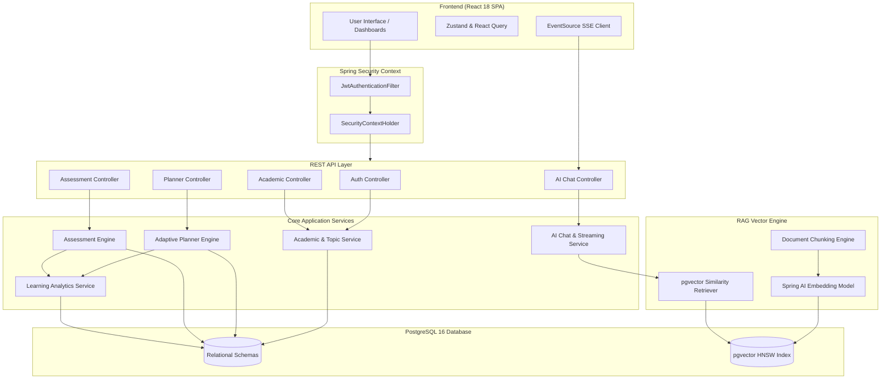
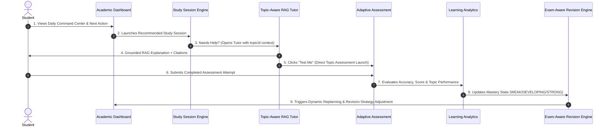
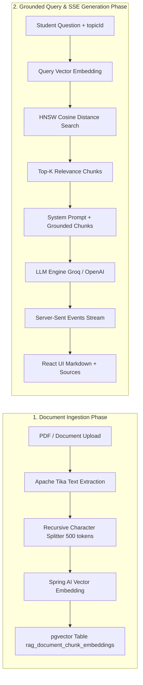

# System Architecture Diagrams

This document illustrates the structural, data flow, and feedback loop diagrams for **Abhi.iterates-OS**.

---

## High-Level System Component Diagram

---

## Primary Closed Feedback Loop Diagram

The core architectural differentiator of Abhi.iterates-OS is its **Closed Feedback Loop**: assessment performance continuously updates mastery states, which instantly reshape study priorities and exam revision schedules.

---

## RAG Vector Ingestion & Query Pipeline

