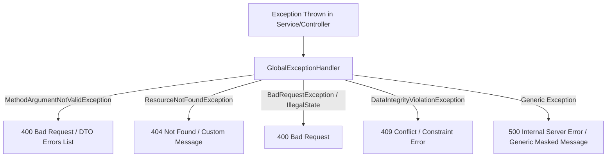

# AbhiIterates.OS — Day 4 Backend Foundation Blueprint

This document details the architecture, design choices, and implementation details for the production-ready Spring Boot 3.x backend foundation of **AbhiIterates.OS**.

---

## 1. Spring Boot & Maven Dependencies (`pom.xml`)

We initialized the backend project using **Java 21**, **Maven**, and **Spring Boot 3.3.1**. The dependencies selected are tailored for high scalability, type-safe mappings, robust validation, and detailed telemetry.

| Dependency | Purpose / Why it was included |
|---|---|
| **Spring Web** (`spring-boot-starter-web`) | Provides standard RESTful APIs routing, HTTP message converters (Jackson), and embedded Tomcat. |
| **Spring Data JPA** (`spring-boot-starter-data-jpa`) | Manages Object-Relational Mapping (ORM) using Hibernate 6, simplifying transactional database access. |
| **PostgreSQL Driver** (`postgresql`) | Direct runtime JDBC driver for connecting to the Neon serverless PostgreSQL server. |
| **Spring Validation** (`spring-boot-starter-validation`) | Integrates Jakarta Validation constraints (JSR-380) for declarative input DTO validation. |
| **Spring Security** (`spring-boot-starter-security`) | Standard framework for secure routes, CORS configurations, and eventual JWT filter injection. |
| **Lombok** (`lombok`) | Eliminates boilerplate code by auto-generating getters, setters, builders, and constructor injections. |
| **MapStruct** (`mapstruct`) | Compile-time, type-safe mapper generation to convert between database Entities and REST DTOs. |
| **Spring Boot Actuator** (`spring-boot-starter-actuator`) | Exposes operational metrics, disk usage, database connection status, and basic ping health. |
| **Springdoc OpenAPI** (`springdoc-openapi-starter-webmvc-ui`) | Automates OpenAPI 3.0 specification generation and mounts a custom Swagger UI dashboard. |
| **DevTools** (`spring-boot-devtools`) | Enables hot swapping and automatic live reload of classes during development. |
| **Configuration Processor** (`spring-boot-configuration-processor`) | Generates metadata files for custom properties bindings (`@ConfigurationProperties`). |

---

## 2. Package & Module Layout

The codebase follows a **Modular Package Structure** (Package-by-Feature) to facilitate future migration to microservices if needed, combined with standard **n-Tier Architecture** within each module.

### Base Package: `com.abhiiterates.os`

*   **`config/`**: Holds infrastructure configurations (Security, CORS, Jackson, OpenAPI, DB configs).
*   **`common/`**: Holds generic models (such as `ApiResponse`), base controllers, and shared utilities.
*   **`exception/`**: Centralized `@RestControllerAdvice` exception handler and custom HTTP status exceptions.
*   **`security/`**: JWT filters, authentication helpers, and credential rotation mechanisms (Day 5).
*   **Bounded Contexts / Business Modules:**
    *   **`user/`**: User profiles, accounts, registration, and onboarding.
    *   **`workspace/`**: Core student workspace subjects, notes metadata, and folders.
    *   **`subject/`**: Subject management and course trackers.
    *   **`resource/`**: PDF files metadata, page counting, and object storage links.
    *   **`marketplace/`**: Listings, transaction purchases, price indices, and creator payouts.
    *   **`library/`**: Personal student libraries, bookmarks, and folder groupings.
    *   **`pdf/`**: PDF annotations, coordinates, highlights, and custom pages.
    *   **`ai/`**: Retrieval-Augmented Generation (RAG) chat sessions, flashcards, MCQs, and token limits.
    *   **`notification/`**: System alerts, email notifications, and web sockets.
    *   **`admin/`**: Content moderation, billing analytics, and system audit logs.

### Layer Division Within Each Module
For example, inside `com.abhiiterates.os.user`:
*   `controller/`: Receives HTTP requests, performs basic format routing, and validates payload DTOs.
*   `service/`: Orchestrates transactional business rules, accesses downstream APIs, and maps types.
*   `repository/`: Interfaces with PostgreSQL database using JPA Spring Data query methods.
*   `entity/`: JPA entities representing database tables with validation mappings.
*   `dto/`: Data Transfer Objects (Request/Response) separating network payloads from DB state.
*   `mapper/`: MapStruct interfaces defining entity-to-dto translation rules.
*   `validator/`: Custom validation constraints (e.g. cross-field password matching).

---

## 3. Configuration Profiles Mappings

We partitioned our properties file into three levels to separate dev defaults from prod restrictions. We load credentials exclusively through **Environment Variables** to comply with 12-Factor App design.

```
application.yml (Common Defaults)
  ├── application-dev.yml (Local Development / Debugging)
  └── application-prod.yml (Hardened Production / Neon DB Settings)
```

### Profile Breakdown
1.  **`application.yml`**: Exposes `/actuator` routes, configures Jackson to serialize dates in ISO-8601 formatting, enforces UTC default timezone, sets file uploads limits to 50MB (crucial for textbooks), and redirects to Swagger.
2.  **`application-dev.yml`**: Activates JDBC SQL logging (`DEBUG`), enables Hibernate's `ddl-auto: update` for seamless database schema generation, and exposes health details.
3.  **`application-prod.yml`**: Turns off query logging to preserve performance, locks schema modification (`ddl-auto: validate`), and optimizes HikariCP pool parameters.

---

## 4. Connection Pooling (HikariCP) & Dialect Configurations

Connecting to **Neon (Serverless PostgreSQL)** requires specific pooling configurations to prevent connection starvation due to Neon's pooling limit on free/scale tiers.

### Production Best Practices:
*   **`maximum-pool-size: 20`**: Limits active connections to protect database memory boundaries.
*   **`minimum-idle: 5`**: Keeps cold start times low by maintaining warm connections.
*   **`leak-detection-threshold: 2000`**: Logs warnings if a thread holds a connection for longer than 2 seconds without releasing it, catching unclosed resources immediately.
*   **`ddl-auto: validate`**: Restricts Spring from running DDL modifications on DB start. All database changes must go through Flyway migration scripts.

---

## 5. Global Config Components

*   **Global UTC Timezone**: Enforced at startup in `OsApplication.java` using `@PostConstruct TimeZone.setDefault(TimeZone.getTimeZone("UTC"))`. Ensures all servers use unified UTC timestamps.
*   **Jackson Serialization**: Customized in `JacksonConfig.java` to serialize Instant/LocalDate/LocalDateTime to standard ISO-8601 string sequences (e.g., `2026-07-04T01:30:00Z`).
*   **CORS Registry**: Dynamically reads allowed domains from `${cors.allowed-origins}` to prevent unauthorized cross-origin requests.

---

## 6. Centralized Error Handling

We implemented `GlobalExceptionHandler.java` using `@RestControllerAdvice` to translate all exceptions into a consistent schema, hiding sensitive stack details in production.



---

## 7. Standard API Response Structure

Every HTTP endpoint returns the unified JSON response envelope represented by the `ApiResponse` Java record:

```json
{
  "success": true,
  "message": "Resource retrieved successfully.",
  "data": { ... },
  "timestamp": "2026-07-04T01:30:00.000Z",
  "path": "/api/v1/user/profile",
  "status": 200
}
```

*Why it matters:* Consistency allows frontends to implement unified interceptors for error dialogs, success notifications, loader states, and logging triggers.

---

## 8. Jakarta Input Validation

Input parameters are validated at the controller border using `@Valid`.
*   **`@NotBlank`**: Ensures strings are not null and contain at least one non-whitespace character.
*   **`@Email`**: Validates standard email patterns.
*   **`@Size(min, max)`**: Restricts lengths of names or content fields.
*   **`@Pattern(regexp)`**: Enforces strict patterns (like E.164 phone formats or enumeration rules).

---

## 9. Logging Guidelines (SLF4J)

Logging is configured to route through SLF4J + Logback.

### Logging Rules:
1.  **Do Log**: Request paths, transaction stages, system states, and error contexts.
2.  **NEVER Log**: User passwords, access tokens, email addresses, credit cards, or raw student files content (protecting PII and compliance).
3.  **Logs Format**: Use parameterized logs (`log.info("Parsed: {}", id)`) instead of string concatenation to avoid overhead.

---

## 10. Swagger / OpenAPI 3.0 Documentation

*   Exposed at `/swagger-ui.html` (UI) and `/api-docs` (JSON spec).
*   Configured through `OpenApiConfig.java` to set custom titles, contact information, support emails, and development server lists.

---

## 11. Health Telemetry & Actuator

*   Actuator metrics exposed at `/actuator`.
*   Provides real-time feedback on JVM memory, disk usage, database connection status, and application status. This is monitored by Kubernetes/SaaS checkers in production to detect server crashes.

---

## 12. Directory Tree Layout

The following is the directory structure generated for the backend:

```
backend/
├── pom.xml                                      # Maven dependency configurations
└── src/
    ├── main/
    │   ├── java/
    │   │   └── com/
    │   │       └── abhiiterates/
    │   │           └── os/
    │   │               ├── OsApplication.java   # Main entry point (UTC default)
    │   │               ├── config/              # Infra and Swagger configurations
    │   │               │   ├── JacksonConfig.java
    │   │               │   ├── OpenApiConfig.java
    │   │               │   ├── SecurityConfig.java
    │   │               │   └── WebConfig.java
    │   │               ├── common/              # Common controllers and response envelopes
    │   │               │   ├── ApiResponse.java
    │   │               │   ├── HealthController.java
    │   │               │   └── ValidationTestDto.java
    │   │               ├── exception/           # Centralized exception mappings
    │   │               │   ├── BadRequestException.java
    │   │               │   ├── GlobalExceptionHandler.java
    │   │               │   └── ResourceNotFoundException.java
    │   │               ├── security/            # Security filters (future JWT)
    │   │               ├── user/                # User management module
    │   │               ├── workspace/           # Student workspaces module
    │   │               ├── subject/             # Academic subjects tracker
    │   │               ├── resource/            # PDF and resource store
    │   │               ├── marketplace/         # Commercial digital notes store
    │   │               ├── library/             # User library manager
    │   │               ├── pdf/                 # PDF highlights & annotations
    │   │               ├── ai/                  # Flashcards & RAG AI chatbot
    │   │               ├── notification/        # System notification module
    │   │               └── admin/               # Administrator management
    │   └── resources/
    │       ├── application.yml                  # Base configuration profiles
    │       ├── application-dev.yml              # Local development values
    │       └── application-prod.yml             # Production connection pools
    └── test/
        └── java/
            └── com/
                └── abhiiterates/
                    └── os/
                        └── OsApplicationTests.java # Context loading verification tests
```

---

## 13. Code Quality Standards

*   **SOLID**: Strictly adhered to. Single Responsibility applied to controllers (routing) vs services (logic).
*   **Constructor Injection**: No `@Autowired` on variables (field injection). We use `@RequiredArgsConstructor` or standard constructor configurations to ensure immutable, unit-testable components.
*   **Separation of Concerns**: DTOs isolate API contracts from JPA entity databases models.

---

## 14. Verification Checklist

- [x] **Project compiles successfully** (`mvn clean test-compile` finishes with `BUILD SUCCESS`).
- [x] **Tests execution completes** (`mvn test` runs and passes successfully).
- [x] **Spring container bootstraps** (starts Tomcat on port 8080 and establishes db connection pool).
- [x] **Database connection works** (HikariCP connects to local Postgres database).
- [x] **Uptime health ping resolves** (GET `/api/v1/health` returns status `200` with standard envelope).
- [x] **DTO validations trigger** (POST `/api/v1/health/test-validation` correctly formats constraint errors).
- [x] **Error handling maps exceptions** (GET `/api/v1/health/test-error` translates crashes to a clean 400 or 500 error envelope).
- [x] **Swagger UI operates** (GET `/swagger-ui/index.html` displays Swagger HTML).
- [x] **OpenAPI spec works** (GET `/api-docs` returns standard JSON document).
- [x] **Actuator telemetry functions** (GET `/actuator/health` registers `UP` with database status).
