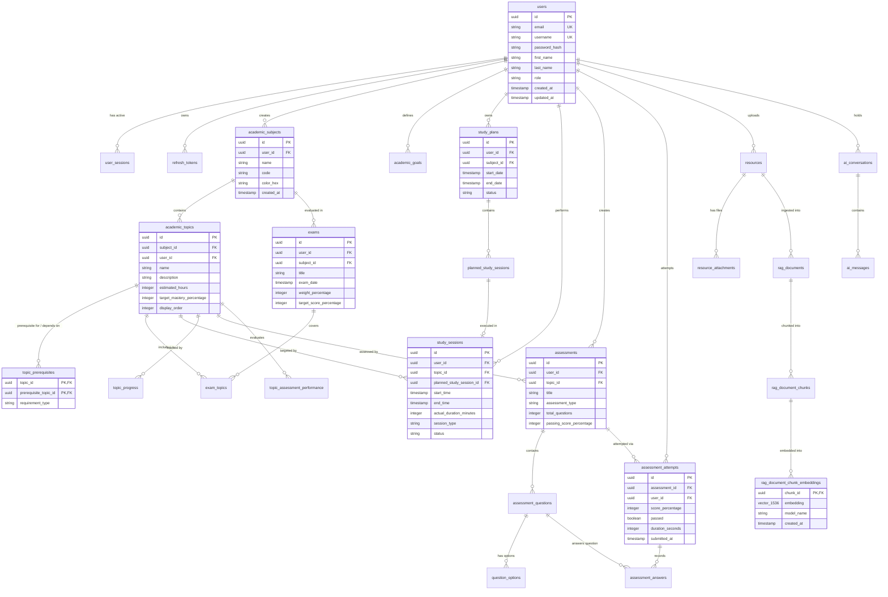

# Database Entity Relationship Diagram (ERD) & Schema Specification

This document details the PostgreSQL relational schema and vector storage structure for **Abhi.iterates-OS**.

---

## Entity Relationship Diagram (Mermaid)



---

## Database Architecture & Optimization Rules

### 1. Primary Keys & UUIDv4 Strategy
- All primary keys use `UUIDv4` generated via Java application-level generator (`@GeneratedValue(strategy = GenerationType.UUID)`) or DB default (`gen_random_uuid()`).
- **Rationale**: Prevents sequential ID enumeration vulnerabilities and facilitates database sharding/replication.

### 2. Foreign Key Indexes & Constraints
- Foreign key constraints enforce relational integrity across all entities with explicit `ON DELETE CASCADE` rules on child detail tables (`assessment_questions`, `question_options`, `assessment_answers`, `rag_document_chunks`).
- Core entities (`academic_topics`, `study_sessions`, `assessments`, `resources`) use restricted soft delete or foreign key protection to prevent accidental cascade deletion of primary student history.

### 3. Vector Storage & HNSW Indexing (`pgvector`)
- Chunk embeddings are stored in `rag_document_chunk_embeddings` using the `vector(1536)` datatype (optimized for OpenAI `text-embedding-3-small` / `text-embedding-ada-002` dimensions).
- Search performance is accelerated using a **Hierarchical Navigable Small World (HNSW)** index:
  ```sql
  CREATE INDEX idx_rag_chunk_embeddings_hnsw 
  ON rag_document_chunk_embeddings 
  USING hnsw (embedding vector_cosine_ops) 
  WITH (m = 16, ef_construction = 64);
  ```

### 4. Audit Metadata & Timestamps
- Every primary table includes:
  - `created_at TIMESTAMP WITH TIME ZONE DEFAULT CURRENT_TIMESTAMP NOT NULL`
  - `updated_at TIMESTAMP WITH TIME ZONE DEFAULT CURRENT_TIMESTAMP NOT NULL`
- JPA `@PrePersist` and `@PreUpdate` lifecycle callbacks manage timestamp synchronization.
