```mermaid
erDiagram
    users {
        uuid id PK
        string email
        string name
        string password_hash
        string role
        string avatar_url
        boolean is_active
        boolean is_email_verified
        string college_name
        string discipline
        timestamp created_at
        timestamp deleted_at
    }

    oauth_accounts {
        uuid id PK
        uuid user_id FK
        string provider
        string provider_user_id
        string email
        timestamp created_at
    }

    refresh_tokens {
        uuid id PK
        uuid user_id FK
        string token_hash
        uuid device_id FK
        uuid family_id
        boolean is_revoked
        timestamp expires_at
        timestamp created_at
    }

    devices {
        uuid id PK
        uuid user_id FK
        string fingerprint
        string user_agent
        string ip_address
        boolean is_trusted
        timestamp last_seen_at
    }

    semesters {
        uuid id PK
        uuid user_id FK
        string name
        string term
        int display_order
        timestamp deleted_at
    }

    subjects {
        uuid id PK
        uuid semester_id FK
        uuid user_id FK
        string name
        string color
        int resource_count
        timestamp deleted_at
    }

    resources {
        uuid id PK
        uuid subject_id FK
        uuid user_id FK
        string title
        string storage_path
        bigint file_size_bytes
        int page_count
        string source
        uuid original_listing_id FK
        int highlight_count
        int bookmark_count
        boolean is_vectorized
        boolean is_archived
        timestamp deleted_at
    }

    tags {
        uuid id PK
        uuid user_id FK
        string name
        string color
    }

    resource_tags {
        uuid resource_id FK
        uuid tag_id FK
        timestamp created_at
    }

    recent_access {
        uuid user_id FK
        uuid resource_id FK
        timestamp accessed_at
    }

    bookmarks {
        uuid id PK
        uuid user_id FK
        uuid resource_id FK
        int page_number
        string label
        timestamp created_at
    }

    highlights {
        uuid id PK
        uuid user_id FK
        uuid resource_id FK
        int page_number
        text selected_text
        string color
        jsonb position_data
        timestamp created_at
    }

    annotations {
        uuid id PK
        uuid user_id FK
        uuid resource_id FK
        uuid highlight_id FK
        int page_number
        text content
        decimal position_x
        decimal position_y
        timestamp created_at
    }

    reading_progress {
        uuid user_id FK
        uuid resource_id FK
        int current_page
        int total_pages
        decimal percent_complete
        timestamp last_read_at
    }

    ai_conversations {
        uuid id PK
        uuid user_id FK
        uuid resource_id FK
        string title
        string model_used
        int message_count
        int total_tokens
        boolean is_pinned
        timestamp updated_at
    }

    ai_messages {
        uuid id PK
        uuid conversation_id FK
        string role
        text content
        int token_count
        timestamp created_at
    }

    ai_citations {
        uuid id PK
        uuid message_id FK
        uuid resource_id FK
        int page_number
        text excerpt
    }

    ai_usage {
        uuid user_id FK
        date usage_date
        int message_count
        int token_count
    }

    categories {
        int id PK
        string name
        string slug
        int parent_id FK
        string icon
        int display_order
    }

    marketplace_listings {
        uuid id PK
        uuid creator_id FK
        int category_id FK
        string title
        text description
        string storage_path
        int price_paise
        string status
        decimal avg_rating
        int total_sales
        int total_views
        timestamp deleted_at
    }

    purchases {
        uuid id PK
        uuid buyer_id FK
        uuid listing_id FK
        uuid payment_id FK
        int purchase_price_paise
        string status
        timestamp completed_at
    }

    payments {
        uuid id PK
        string razorpay_order_id
        string razorpay_payment_id
        int amount_paise
        string currency
        string status
        jsonb gateway_response
    }

    reviews {
        uuid id PK
        uuid listing_id FK
        uuid buyer_id FK
        uuid purchase_id FK
        text content
        boolean is_visible
        timestamp created_at
    }

    ratings {
        uuid id PK
        uuid listing_id FK
        uuid buyer_id FK
        uuid purchase_id FK
        int score
        timestamp created_at
    }

    wishlists {
        uuid user_id FK
        uuid listing_id FK
        timestamp created_at
    }

    creator_profiles {
        uuid user_id PK
        string display_name
        text bio
        string website_url
        string payout_upi_id
        bigint total_earnings_paise
        int total_sales
        boolean is_verified
    }

    creator_earnings {
        uuid id PK
        uuid creator_id FK
        uuid purchase_id FK
        int gross_amount_paise
        int platform_fee_paise
        int net_amount_paise
        string status
        timestamp settled_at
    }

    notifications {
        uuid id PK
        uuid recipient_id FK
        string type
        string title
        text body
        string entity_type
        uuid entity_id
        boolean is_read
        timestamp created_at
    }

    audit_logs {
        bigint id PK
        uuid user_id FK
        string action
        string entity_type
        uuid entity_id
        jsonb old_value
        jsonb new_value
        string ip_address
        timestamp created_at
    }

    login_history {
        bigint id PK
        uuid user_id FK
        string email_attempted
        boolean is_success
        string ip_address
        timestamp created_at
    }

    %% IDENTITY RELATIONSHIPS
    users ||--o{ oauth_accounts : "authenticates via"
    users ||--o{ refresh_tokens : "holds"
    users ||--o{ devices : "uses"
    refresh_tokens }o--|| devices : "bound to"

    %% LIBRARY RELATIONSHIPS
    users ||--o{ semesters : "owns"
    semesters ||--o{ subjects : "contains"
    subjects ||--o{ resources : "organizes"
    users ||--o{ resources : "owns"
    users ||--o{ tags : "creates"
    resources }o--o{ tags : "tagged with"
    resource_tags }|--|| resources : ""
    resource_tags }|--|| tags : ""
    users ||--o{ recent_access : "tracks"
    resources ||--o{ recent_access : "tracked by"

    %% PDF WORKSPACE RELATIONSHIPS
    users ||--o{ bookmarks : "saves"
    resources ||--o{ bookmarks : "has"
    users ||--o{ highlights : "creates"
    resources ||--o{ highlights : "has"
    users ||--o{ annotations : "writes"
    resources ||--o{ annotations : "has"
    highlights ||--o{ annotations : "attached to"
    users ||--o{ reading_progress : "tracks"
    resources ||--o{ reading_progress : "tracked by"

    %% AI RELATIONSHIPS
    users ||--o{ ai_conversations : "has"
    resources ||--o{ ai_conversations : "context for"
    ai_conversations ||--o{ ai_messages : "contains"
    ai_messages ||--o{ ai_citations : "cites"
    resources ||--o{ ai_citations : "referenced by"
    users ||--o{ ai_usage : "tracked by"

    %% MARKETPLACE RELATIONSHIPS
    users ||--o| creator_profiles : "has"
    users ||--o{ marketplace_listings : "creates"
    categories ||--o{ marketplace_listings : "categorizes"
    categories ||--o{ categories : "parent of"
    marketplace_listings ||--o{ purchases : "bought via"
    users ||--o{ purchases : "makes"
    purchases ||--|| payments : "settled by"
    marketplace_listings ||--o{ reviews : "receives"
    users ||--o{ reviews : "writes"
    marketplace_listings ||--o{ ratings : "rated by"
    users ||--o{ wishlists : "saves"
    marketplace_listings ||--o{ wishlists : "saved in"
    purchases ||--o{ creator_earnings : "generates"
    users ||--o{ creator_earnings : "earns"

    %% NOTIFICATIONS & AUDIT
    users ||--o{ notifications : "receives"
    users ||--o{ audit_logs : "recorded in"
    users ||--o{ login_history : "tracked by"

    %% PURCHASED RESOURCE LINK
    resources }o--o| marketplace_listings : "sourced from"
```

# ER Diagram — AbhiIterates.OS

Complete Entity Relationship Diagram in Mermaid syntax.
Covers all 30 tables and their relationships.

---

---

## Diagram Key

**Crow's Foot Notation:**
- `||` — exactly one
- `|o` — zero or one
- `o{` — zero or many
- `|{` — one or many

---

## Relationship Summary

| Relationship | Explanation |
|---|---|
| `users → semesters` | A user owns many semesters. Semester cannot exist without a user. |
| `semesters → subjects` | A semester contains many subjects. Subject is meaningless without a semester. |
| `subjects → resources` | A subject organizes many resources. Resources can be moved between subjects. |
| `resources → marketplace_listings` | A purchased resource traces back to its original listing (for updates). Nullable — uploaded resources have no listing origin. |
| `purchases → payments` | Every purchase has exactly one payment. Payment is created first (Razorpay order), then purchase is confirmed on payment success. |
| `users → creator_profiles` | Only users with CREATOR role have a profile. Zero-or-one. |
| `ai_conversations → resources` | A conversation is grounded in one resource (nullable for standalone AI chat). |
| `highlights → annotations` | An annotation can be attached to a highlight, or exist as a standalone sticky note. |
| `categories → categories` | Self-referencing for hierarchy: Engineering → Computer Science → DBMS. |
| `purchases → creator_earnings` | Every completed purchase generates exactly one creator_earnings record, after platform fee deduction. |
